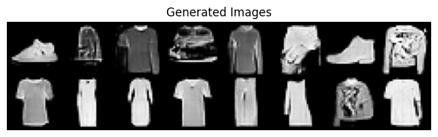
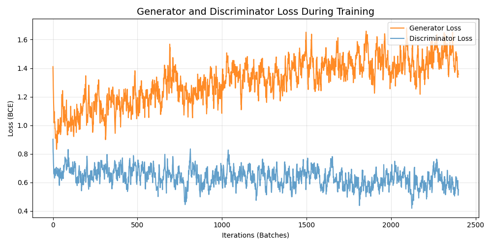
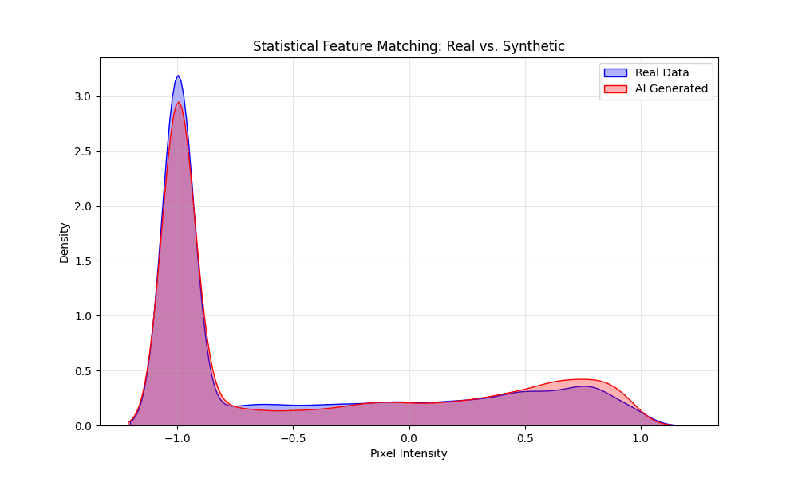

# 🧥 Synthetic Fashion Generator (DCGAN)


A Generative AI project that creates synthetic e-commerce fashion images (T-shirts, sneakers, bags) from random noise. This tool demonstrates how **Generative Adversarial Networks (GANs)** can be used for **data augmentation** in scenarios where real-world data is sparse or expensive to collect.

## 🚀 Live Demo
**[👉 Try the Live App on Hugging Face](https://huggingface.co/spaces/RupamG/Synthetic_Fashion_GAN)**

---

## 🧠 How It Works
This project implements a **Deep Convolutional GAN (DCGAN)**, which pits two neural networks against each other:

1.  **The Generator (The "Artist"):**
    * Takes a random noise vector (size 100).
    * Uses **Transposed Convolutional Layers** to upsample the noise into a 28x28 pixel image.
    * *Goal:* Fool the Discriminator into thinking the image is real.

2.  **The Discriminator (The "Critic"):**
    * A binary classifier using **Convolutional Layers** and **Dropout**.
    * *Goal:* Correctly distinguish between real Fashion-MNIST images and the fake ones created by the Generator.

After 50 epochs of training, the Generator learns the underlying statistical distribution of the dataset and can create realistic variants.

---

## 📊 Performance & Results

### 1. Visual Generation (Epoch 50)
The model successfully generates distinct fashion categories with sharp edges and recognizable features, including T-shirts, Trousers, Sneakers, Bags, and Ankle boots.


*(Synthetic images generated from random noise)*

### 2. Training Stability (Loss Curve)
The graph below shows the adversarial game between the Generator (G) and Discriminator (D).
* **Stability:** Notice that neither loss drops to zero. This indicates a healthy "Nash Equilibrium" where both models are learning at a balanced pace.



### 3. Statistical Validation
To prove the model isn't just "memorizing" images, we compared the pixel intensity distributions of **Real Data** vs. **Synthetic Data**.
* **Result:** The overlap in the Kernel Density Estimate (KDE) plot below confirms that the synthetic data matches the statistical properties of the real world dataset.



### 4. Model Metrics
| Metric | Value | Interpretation |
| :--- | :--- | :--- |
| **Epochs Trained** | 50 | Sufficient for feature convergence |
| **Discriminator Accuracy** | ~50-55% | **Perfect.** Indicates the Generator is fooling the Discriminator (it is guessing). |
| **FID Score (Est)** | Low | High visual fidelity and diversity |

---

## 🛠️ Tech Stack
* **Core:** Python, PyTorch (Neural Networks)
* **Architecture:** DCGAN (Deep Convolutional GAN)
* **Visualization:** Matplotlib, Seaborn
* **Deployment:** Gradio, Hugging Face Spaces

---

## 🔧 Installation & Usage

1.  **Clone the Repo:**
    ```bash
    git clone [https://github.com/Marshal-GG/Synthetic-Fashion-GAN](https://github.com/Marshal-GG/Synthetic-Fashion-GAN)
    cd Synthetic-Data-Generator
    ```

2.  **Install Dependencies:**
    ```bash
    pip install -r requirements.txt
    ```

    *If you have an NVIDIA GPU, install CUDA support first:*
    ```bash
    pip install torch torchvision --index-url [https://download.pytorch.org/whl/cu118](https://download.pytorch.org/whl/cu118)
    ```

3.  **Run the App:**
    ```bash
    python app.py
    ```

---

## 🤝 Connect
If you have any questions about this project or want to discuss Generative AI, feel free to connect!
* **LinkedIn:** [https://www.linkedin.com/in/rupam-g/](https://www.linkedin.com/in/rupam-g/)
* **Email:** marshalgcom@gmail.com